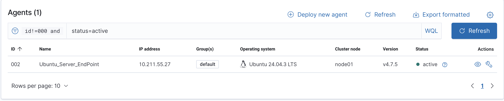
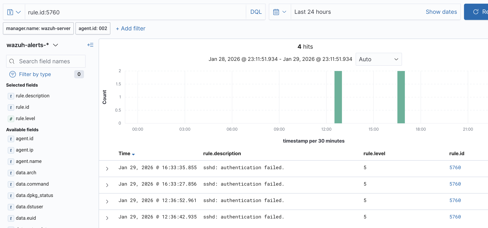
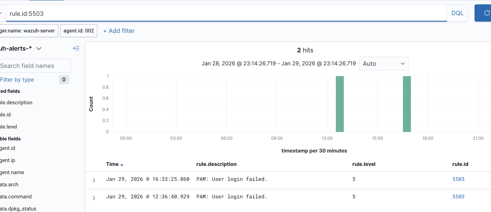
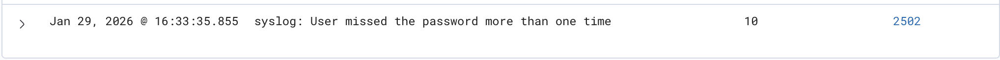
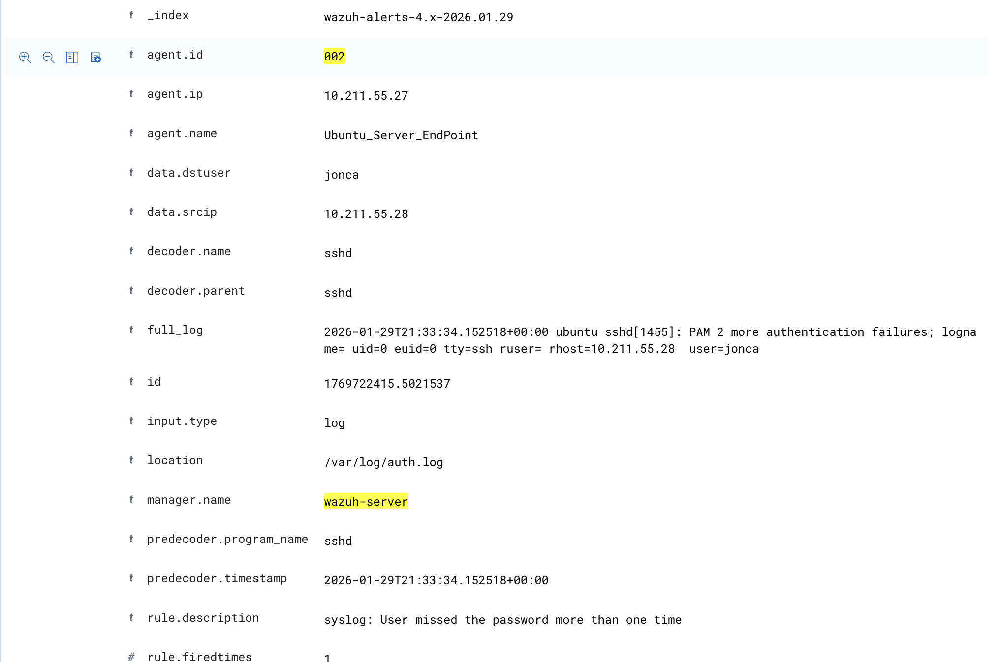

# wazuh-ssh-bruteforce-lab
Detecting SSH brute-force attempts using Wazuh SIEM
SSH Brute Force Detection Using Wazuh SIEM

This project demonstrates my ability to simulate real attack activity, analyze SIEM alerts, and investigate authentication-based threats from a blue-team perspective.

To gain hands-on experience in defensive security, I built a personal lab to replicate real-world attack and detection scenarios and practice SOC-style investigation workflows. The goal of this lab is to understand how a security monitoring platform behaves when a threat actor attempts to access a system, and how those events can be analyzed from a SOC analyst’s perspective.
Using Wazuh SIEM, I monitored and analyzed unauthorized SSH authentication attempts against a Linux server.

Lab Architecture
The lab is intentionally simple but realistic:
* Wazuh Manager: Ubuntu VPS hosted on OVHcloud
* Defender: Ubuntu Server with Wazuh Agent installed
* Attacker: Kali Linux (no Wazuh agent installed)
* Monitoring Interface: Wazuh Dashboard
This setup reflects a common enterprise scenario where attacker systems are not instrumented, and detection relies entirely on defender-side telemetry.

### Architecture Evidence

*Figure 1: Wazuh agent overview showing the Ubuntu server actively reporting to the Wazuh manager. The attacker system (Kali Linux) is intentionally not instrumented.*

Objective
Detect and analyze unauthorized SSH authentication attempts against a Linux server using Wazuh SIEM, and validate that alerts and correlation rules function as expected.

Attack Simulation
From the Kali Linux system, I performed multiple failed SSH login attempts against the Ubuntu server. These repeated authentication failures were intended to simulate a brute-force attack and trigger Wazuh correlation rules.

Detection and Analysis

*Figure 2: Individual SSH authentication failure events generated after multiple failed login attempts.*

*Figure 3: PAM authentication failure events recorded on the Ubuntu server.*

*Figure 4: Correlation alert triggered after repeated SSH authentication failures.*

Investigation Process
During analysis, I:
* Verified log ingestion from /var/log/auth.log on the Ubuntu server
* Identified the correct searchable fields available in the Wazuh index
* Adapted searches based on observed fields, including:
    * rule.id
    * rule.description
    * rule.level
Example query used:
rule.id:5760
This approach reflects real-world SIEM investigation, where searches are refined based on actual indexed data rather than assumed field names.

*Figure 5: Detailed event view showing source IP address, targeted user account, and log source.*

MITRE ATT&CK Mapping
* T1110 – Brute Force
* Tactic: Credential Access

Outcome
* Confirmed that Wazuh successfully detected and correlated SSH brute-force attempts
* Demonstrated a realistic SOC-style alert investigation workflow
* Validated SIEM visibility from log ingestion through alert generation

Lessons Learned
* The importance of understanding SIEM field mappings and data schemas
* The difference between raw log events and correlated security alerts
* How even unsuccessful attack attempts leave detectable forensic traces
